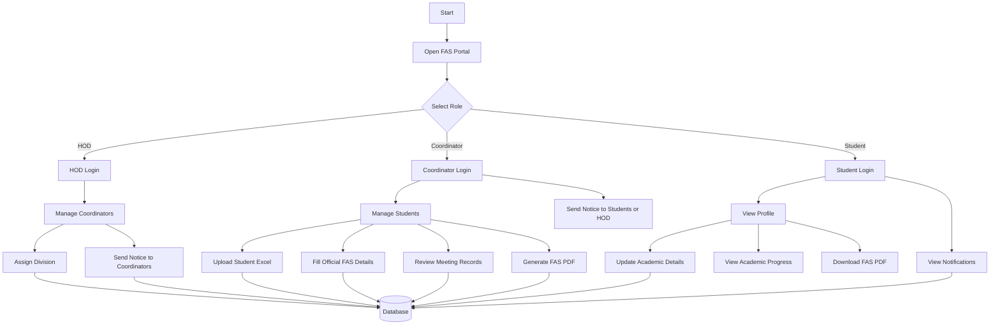
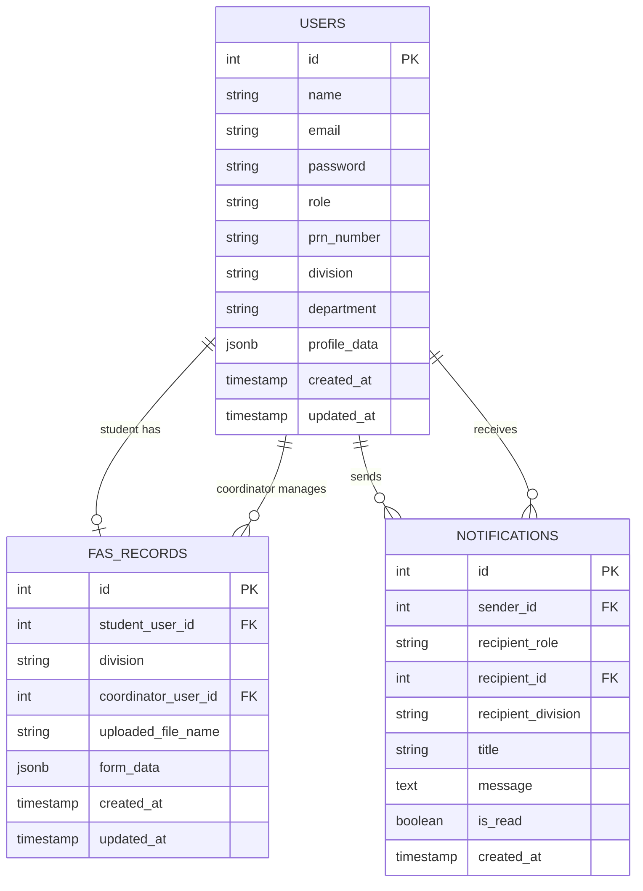

# Sandip University FAS Management System

## 1. Project Title

**Sandip University FAS Management System**

The project is a web-based Faculty Academic System (FAS) portal designed for Sandip University. It provides separate digital consoles for HODs, coordinators, and students to manage academic records, student information, FAS form details, communication notices, and PDF generation.

## 2. Introduction

The Faculty Academic System is an important part of academic monitoring and student mentoring. Traditionally, FAS details are maintained manually through printed forms, handwritten records, spreadsheets, and offline communication. This process can be time-consuming, difficult to track, and prone to errors.

The Sandip University FAS Management System digitizes this workflow. It allows HODs to manage coordinators, coordinators to manage division-wise student records, and students to view or update their academic progress. The system also supports FAS PDF generation in the official form structure and includes notification features for communication between HOD, coordinator, and student users.

## 3. Problem Statement

In the manual FAS process, student academic records and mentoring details are often stored in physical documents or scattered Excel files. This creates problems such as:

- Difficulty in maintaining updated student records.
- Repeated manual entry of the same information.
- Delay in communication between HODs, coordinators, and students.
- Risk of missing or incomplete FAS forms.
- Difficulty in generating a clean official FAS document.
- Lack of centralized access for different academic roles.

Therefore, there is a need for a centralized digital platform that manages the complete FAS workflow with role-based access, secure authentication, student record management, academic progress tracking, communication, and PDF generation.

## 4. Abstract

The Sandip University FAS Management System is a full-stack web application developed to simplify and digitize the Faculty Academic System workflow. The system provides three major portals: HOD, Coordinator, and Student. The HOD can add coordinators, assign divisions, monitor records, and send notices. The coordinator can upload students, manage student information, fill official academic details, review meeting records, and generate FAS PDF files. The student can log in using PRN credentials, view profile details, update academic information, check mentor details, and download the FAS form.

The system uses HTML, CSS, and JavaScript for the frontend, Node.js and Express.js for the backend, PostgreSQL/Neon for database storage, JWT for authentication, and PDF generation logic for official FAS output. By replacing manual paperwork with a role-based digital system, the project improves accuracy, accessibility, communication, and sustainability.

## 5. Objectives

- To digitize the manual Faculty Academic System process.
- To provide secure role-based login for HOD, coordinator, and student users.
- To allow HODs to manage coordinators and division allocation.
- To allow coordinators to upload and manage students division-wise.
- To allow students to view and update their academic information.
- To generate FAS PDF forms in the required official format.
- To improve communication through notice/notification features.
- To reduce paperwork and make record maintenance easier.
- To provide a centralized academic monitoring platform.

## 6. Project Overview

The application is divided into frontend and backend modules.

The frontend contains the user interface for:

- Landing page and role selection.
- HOD dashboard.
- Coordinator dashboard.
- Student dashboard.
- FAS form display and PDF download.
- Notification modals and dashboard tabs.

The backend handles:

- Authentication and authorization.
- HOD, coordinator, and student APIs.
- Student upload and record management.
- FAS data storage.
- Notification management.
- PostgreSQL database schema creation and data operations.

The database stores users, student records, coordinator data, FAS records, and notifications.

## 7. Key Features

### 7.1 Role-Based Login

The system has three different user roles:

- HOD
- Coordinator
- Student

Each role has a separate dashboard and permissions.

### 7.2 HOD Console

The HOD console is designed for department-level control. Main functions include:

- HOD login using email and password.
- Add coordinator manually.
- Upload or sync coordinator data.
- Assign division to coordinators.
- View coordinator list.
- View dashboard overview.
- Send notices to coordinators.
- Receive notifications from coordinators.
- Maintain HOD profile information.

### 7.3 Coordinator Console

The coordinator console is used for managing division-wise students and FAS work. Main functions include:

- Coordinator login using assigned credentials.
- Upload student list using Excel files.
- View students assigned to the coordinator's division.
- Manage student profile and FAS data.
- Fill official academic year details.
- Review student meeting reports.
- Download student FAS PDF by PRN.
- Send notices to students.
- Send notices to HOD.
- Maintain coordinator/mentor profile information.

### 7.4 Student Console

The student console is used by students to view and manage their own academic record. Main functions include:

- Student login using PRN number and date of birth password.
- View student profile details.
- Update student details and academic information.
- View academic progress.
- View coordinator/mentor information.
- Add meeting/problem details.
- Receive notices from coordinator.
- Download completed FAS PDF.

### 7.5 FAS PDF Generation

The system can generate a PDF form based on the official FAS format. Data is collected from:

- Student profile.
- Academic progress.
- Coordinator profile.
- Official academic year details.
- Meeting records.
- FAS form data.

This helps reduce manual writing and makes the final document clean and consistent.

### 7.6 Notification System

The project includes communication through notifications:

- HOD can send notices to coordinators.
- Coordinator can send notices to students.
- Coordinator can send notices to HOD.
- Users can view unread notices from their dashboard.

## 8. About HOD Login

The HOD login is the highest-level administrative login in the system. It is mainly used for department management. After login, the HOD can create coordinator accounts, allocate divisions, view coordinator information, and send important notices.

The HOD login helps ensure that coordinator access is controlled by the department authority and that each coordinator is assigned to the correct division.

## 9. About Coordinator Login

The coordinator login is used by faculty coordinators who manage students from a specific division. Once logged in, the coordinator can upload student data, manage student records, fill official FAS fields, review student meeting reports, and generate student FAS PDFs.

The coordinator acts as the bridge between the HOD and students. This login is important because most FAS data verification and academic record management is handled by the coordinator.

## 10. About Student Login

The student login allows individual students to access their own FAS details. Students can log in using their PRN number and password based on their date of birth. After login, they can view their profile, academic progress, mentor details, notices, and download their FAS form.

This login improves transparency because students can check whether their academic details are complete and accurate.

## 11. Technical Skills Used

### 11.1 Frontend Skills

- HTML5 for page structure.
- CSS3 for styling and responsive layout.
- JavaScript for dashboard logic and dynamic UI.
- DOM manipulation for tabs, forms, modals, and dashboard interactions.
- Lucide icons for visual interface elements.
- Client-side PDF rendering/download logic.
- Responsive UI design for role-based dashboards.

### 11.2 Backend Skills

- Node.js runtime.
- Express.js for API development.
- PostgreSQL database integration.
- Neon cloud database support.
- JWT authentication.
- bcrypt password hashing.
- Multer for file upload handling.
- xlsx package for Excel student/coordinator upload processing.
- REST API design.
- Middleware-based authentication and authorization.

### 11.3 Database Skills

- PostgreSQL table design.
- JSONB storage for flexible profile and FAS form data.
- Foreign key relationships.
- Indexing for faster lookup.
- User-role based data access.

## 12. Technology Stack

| Layer | Technology |
| --- | --- |
| Frontend | HTML, CSS, JavaScript |
| Backend | Node.js, Express.js |
| Database | PostgreSQL / Neon |
| Authentication | JWT, bcrypt |
| File Upload | Multer |
| Excel Processing | xlsx |
| PDF Feature | JavaScript PDF generation |
| Hosting | Vercel / Render-ready configuration |

## 13. Environment Impact and Sustainability

This project supports sustainability by reducing dependency on printed FAS forms and manual paperwork. Since student records, academic progress, meeting details, and official information can be stored digitally, the system helps save paper and printing resources.

Environmental benefits include:

- Reduced paper usage.
- Less printing and photocopying.
- Lower physical storage requirement.
- Easier digital sharing of academic records.
- Reduced manual travel between departments for form submission.

The system also improves long-term sustainability because digital records are easier to update, back up, and reuse.

## 14. Project Development Timeline

| Phase | Description | Approximate Duration |
| --- | --- | --- |
| Project Planning Phase | Requirement analysis, role identification, database planning, and UI planning. | 1 week |
| Frontend Development | Development of landing page, HOD dashboard, coordinator dashboard, student dashboard, forms, tabs, and modals. | 2 to 3 weeks |
| Backend Development | API creation for authentication, HOD, coordinator, student, FAS records, and notifications. | 2 to 3 weeks |
| Database Integration | PostgreSQL schema setup, user records, FAS records, notifications, and JSONB profile data. | 1 week |
| PDF and FAS Format Integration | Mapping student/coordinator details into official FAS PDF structure. | 1 to 2 weeks |
| Integration Testing | Testing role-wise login, upload, update, notification, and PDF flow. | 1 week |
| Hosting and Deployment | Preparing frontend/backend hosting configuration and environment variables. | 2 to 4 days |

## 15. Cost Efficiency Analysis

### 15.1 Human Resource Cost

The project can be developed by a small student team. Since the system uses open-source technologies, the main cost is development time rather than paid development tools.

| Resource | Estimated Cost |
| --- | --- |
| Student developer/team | Academic project effort |
| Faculty guidance | Included in academic supervision |
| Testing effort | Student/team based |

### 15.2 Hardware Resource Cost

The system does not require expensive hardware. Development can be done on a normal laptop or desktop.

| Hardware | Requirement | Cost Efficiency |
| --- | --- | --- |
| Developer laptop/PC | Basic system with Node.js support | Already available |
| Server | Cloud/serverless hosting | Low cost |
| Storage | Database cloud storage | Minimal for academic use |

### 15.3 Software and Development Tools

Most tools used in this project are free or open source.

| Tool | Purpose | Cost |
| --- | --- | --- |
| VS Code | Code editor | Free |
| Node.js | Backend runtime | Free |
| Express.js | Backend framework | Free |
| PostgreSQL | Database | Free/open source |
| Neon | Cloud database | Free tier available |
| Vercel/Render | Hosting | Free tier available |
| Git/GitHub | Version control | Free |

### 15.4 Overall Cost Efficiency

The project is highly cost-efficient because it uses open-source technologies, free hosting/database tiers for academic-scale deployment, and does not require dedicated physical infrastructure. It also reduces future paper, printing, and manual record maintenance costs.

## 16. System Flowchart

## 17. ER Diagram

## 18. Advantages

- Centralized FAS data management.
- Faster record access.
- Reduced manual paperwork.
- Role-wise secure login.
- Better communication through notifications.
- Easy student upload through Excel.
- PDF generation in official format.
- Better coordination between HOD, coordinator, and students.

## 19. Limitations

- Requires internet access if deployed online.
- Accuracy depends on correct data entered by users.
- Hosting and database limits may apply on free plans.
- More advanced analytics can be added in future versions.

## 20. Future Scope

- Add advanced reporting and analytics.
- Add email/SMS notification support.
- Add admin-level dashboard.
- Add digital signature support.
- Add attendance and result integration.
- Add mobile application support.
- Add automatic reminder system for incomplete FAS records.

## 21. Conclusion

The Sandip University FAS Management System provides an efficient digital solution for managing Faculty Academic System records. It simplifies the work of HODs, coordinators, and students by providing separate role-based dashboards, centralized data storage, student record management, notification support, and official FAS PDF generation.

This project improves accuracy, saves time, reduces paperwork, and supports a more sustainable academic workflow. It is cost-efficient, scalable for academic use, and can be further enhanced with advanced reporting and automation features.

